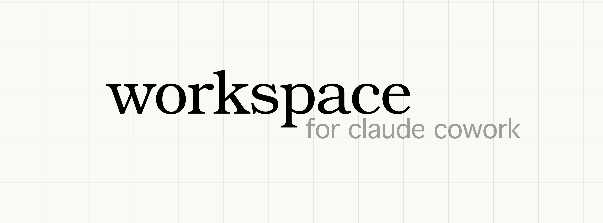

# Claude Workspace - A Blueprint

Claude Cowork leverages the power of Claude Code while working in the Claude App. Unfortunately it is missing some features like project specific skills, memory or workflows.

That's why we're proposing a blueprint for a Claude Workspace: A Workspace is a folder that turns Claude into a domain-specific assistant. A project that can just be opened as a folder within Claude. This project can have **multiple workflows** that are available to you.

This repository is both the spec and a working example (a meeting notes assistant). Everything here demonstrates the patterns any Workspace should follow.


## ✨ Key Features

- 🏗️ **Flexible blueprint** — You can use this blueprint for any set of tasks
- 🧙🏽‍♂️ **Setup Wizard** — An initial workflow will ask for user preferences and checks dependancies
- 📚 **Context** — A custom context folder for user preferences and reference material.
- 🔄 **Reusable workflows** — Define once, use across sessions and workspaces.
- 🧠 **Logging** — Context and preferences persist between sessions.
- 📦 **Progressive disclosure** — Only loads instructions when needed.
- ✏️ **No code required** — Just markdown files and folders.


## 🚀 How to Use a Workspace

1. Download the Workspace folder (or receive it as a zip)
2. Open Claude Desktop and go to Claude Cowork
3. Open the folder as a project
4. Say hi!, and a setup should start.

## How does it work?
Workspaces are designed for Claude Cowork, a feature in the Claude Desktop app that lets you open a folder as a project. When Claude Cowork opens a folder, it reads the CLAUDE.md file and follows the instructions inside. When needed it can read project-specific workflows for instructions that you give it, using a method called progressive disclosure.


## 📁 Structure

Every Workspace looks like this:

```
my-workspace/
  CLAUDE.md                            # Entry point. The only file Claude reads upfront.
  _workspace/
    config/                            # System workflows (not user-facing).
      _setup.md                        # Onboarding and configuration.
      _log.md                          # Session logging.
      _add-context.md                  # Document conversion.
    workflows/                         # User-facing workflows. One file per workflow.
      [workflow-name].md
    context/                           # User preferences. Gitignored.
    logs/                              # Session logs. Gitignored.
    sources/                           # Reference material. Gitignored. Recommended.
  [user-facing folders]/               # Workspace-specific. Gitignored.
```

Rules:
- `_workspace/` is reserved: don't use it for user content
- Files prefixed with `_` are system files
- All user data folders must be gitignored


## 📄 CLAUDE.md

The entry point. Claude reads this upfront and uses it to route user intent to workflow files. It must contain these sections, in order:

### Header

```markdown
# [Workspace Title]
- Name: [short name]
- Description: [what this workspace does]
- Version: [version number]
- Spec version: [spec version this workspace follows]
- Author: [who made it]
```

### Requirements

What the workspace needs. Two levels:

- Hard: Won't work without these. Setup should block or warn prominently.
- Recommended: Works without these, but some workflows will be limited.

If there are no hard requirements, say so explicitly.

```markdown
## Requirements

### Hard
None — this Workspace works out of the box.

### Recommended
- Google Calendar MCP: Enables the Prepare Meeting workflow to pull upcoming meetings, attendees, and agendas. Without it, meeting prep still works but relies on the user providing meeting details manually.
```

### Folder Structure

Lists all folders, split into system folders (versioned, part of the template) and user data folders (gitignored, created during setup).

```markdown
## Folder Structure

### System folders (versioned, part of the template)
- `_workspace/config/`: Internal system workflows
- `_workspace/workflows/`: User-facing workflow instructions

### User data folders (gitignored, personal to each user)
- `_workspace/context/`: User preferences and configuration
- `_workspace/logs/`: Session logs
- `_workspace/sources/`: User-provided reference material
- `meeting-notes/`: Meeting notes, one file per meeting
```

### Workflows

Maps user intent to workflow files. Every entry needs a name, a file path, and trigger examples. Split into:

- Default Workflows: Setup, Logging, Add Context. System workflows present in every workspace.
- User Workflows: What makes this workspace unique.

Must end with: `Before executing any workflow, you MUST read its instruction file in full.`

```markdown
## Workflows
Claude activates the matching workflow based on user intent. Read the user's intent and activate automatically — do not wait for a command.

### Default Workflows
These are default workflows that come with any workspace:
- Setup (`_workspace/config/_setup.md`): Says "set up my space", "configure", or opens the project for the first time. System workflow.
- Logging (`_workspace/config/_log.md`): Session logging, runs after every workflow. System workflow.
- Add Context (`_workspace/config/_add-context.md`): Wants to add a document or reference material (e.g. "add this to sources", "convert this PDF", "save this document"). System workflow.

### User Workflows
- Note-Taking (`_workspace/workflows/notetaking.md`): Wants to capture meeting notes (e.g. "notes from today's standup", "let me recap the meeting", "new meeting note").
- Tasks (`_workspace/workflows/tasks.md`): Asks to manage tasks or action items (e.g. "what are my open tasks?", "add a task", "show my action items").
- Prepare Meeting (`_workspace/workflows/prepare-meeting.md`): Wants to prepare for an upcoming meeting (e.g. "prep me for my next meeting", "what do I need for the PVH sync?", "prepare for tomorrow's standup"). Requires Google Calendar MCP.

Before executing any workflow, you MUST read its instruction file in full. This is progressive disclosure — the detailed instructions are loaded on-demand, not upfront.
```

### Ground Rules

Must include at least these four:
- User data is sacred: never overwrite or delete without permission
- Never invent: only use what the user actually provided
- Always log sessions: run the logging workflow after every workflow
- Read files first: never edit a file you haven't read in this session

Authors can add more.

```markdown
## Ground Rules
- Notes belong to the user: Never overwrite or delete existing notes without explicit permission.
- Never invent: Only capture what the user actually said or provided. Don't add information that wasn't in the meeting.
- Always log sessions: After completing any workflow, read and execute `_workspace/config/_log.md` to append an entry to the daily log. No log = session not finished.
- Read files first: Before modifying any existing file, ALWAYS read it first. Never append to a file you haven't read in this session.
```

### Tone

How Claude should communicate. Without it, Claude defaults to generic behavior.

```markdown
## Tone
- Clear and direct
- Match the user's energy: brief when they're brief, detailed when they want depth
- Keep responses scannable: headers, short paragraphs, whitespace
```

### Do Not

Explicit anti-patterns for this workspace.

```markdown
## Do Not
- Ask for input for the sake of asking a question and if an answer is implied by the user already.
```

### Setup Trigger

Last line. Triggers the setup workflow on first run, then gets commented out:

```markdown
ACTIVATE: Setup workflow — read `_workspace/config/_setup.md` and execute.
```


## 📝 Workflow Files

Each workflow is a standalone markdown file. It should contain everything Claude needs — don't assume context from other files.

Guidelines:
- Be specific: tell Claude what to do, what to ask, what to output, where to save
- Include examples: show expected output format, file naming, templates
- State constraints: if the workflow has rules, state them explicitly


## ⚙️ Default Workflows

Every workspace includes these three. They live in `_workspace/config/`.

### Setup (`_setup.md`)

Runs on first use. Must:
1. Verify folders exist (create missing ones)
2. Check requirements and report status
3. Walk the user through personalization
4. Save preferences to `_workspace/context/preferences.md`
5. Show available workflows
6. Log the session
7. Comment out the ACTIVATE line so setup doesn't repeat

### Logging (`_log.md`)

Runs after every workflow. Must:
1. Append to `_workspace/logs/LOG_yyyy_mm_dd.md` (one file per day)
2. Record which workflow ran, what happened, what files changed
3. Never log private content: summarize topics only

### Add Context (`_add-context.md`)

Lets users add reference material. Must:
1. Accept documents, images, pasted text, or URLs
2. Convert to clean markdown in `_workspace/sources/`
3. Preserve content faithfully: no summarizing


## 🛠️ Building Your Own

1. Copy this repo or create the structure from scratch
2. Write your CLAUDE.md following the spec above
3. Create your setup workflow in `_workspace/config/_setup.md`
4. Add workflow files to `_workspace/workflows/`
5. Zip and share


## 🔮 What's Next

This spec is a draft. We're working toward:

- A skill that generates Workspaces from a description
- A library of community Workspaces
- Native Claude Cowork integration
